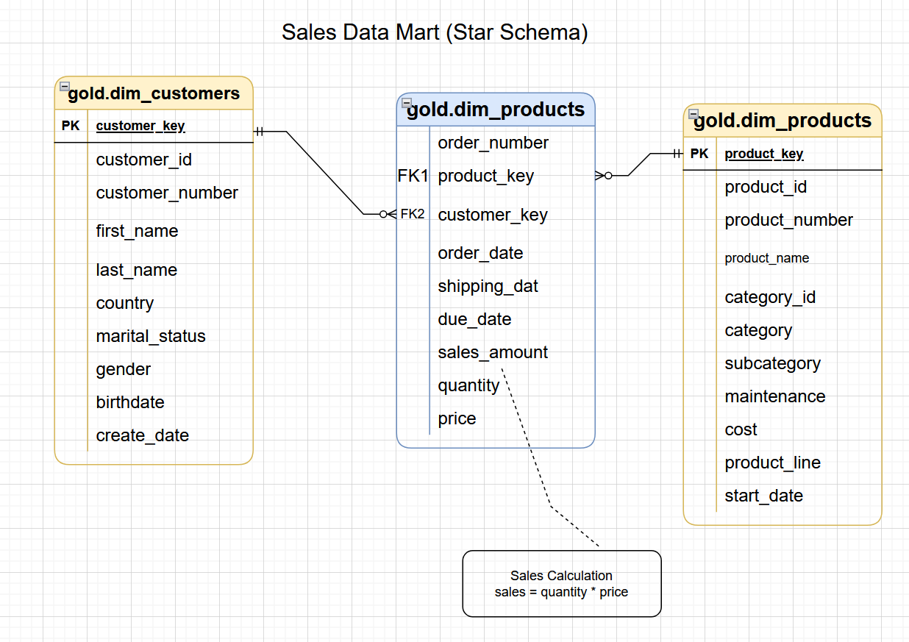

# Data Warehouse and Analytics Project 

Welcome to the Data Warehouse and Analytics Project repository! 🚀
This project demonstrates an end-to-end data warehousing and analytics solution, from building a SQL Server–based data warehouse to generating meaningful analytical insights.

**Key features beyond a standard medallion build:**
- **SCD Type 2 product dimension**: sales are matched to the product version (and cost) valid on the order date
- **ETL logging and error handling**: every table load is logged with row counts, duration, and status; failures are re-thrown instead of silently swallowed
- **Analytical SQL**: seven business analyses using window functions, including RFM customer segmentation and historical margin analysis

## Key Findings

**Product history changes the margin story**

When I first built the product dimension, I only kept the current version of each product, which meant every past sale was costed at today's price. Once I kept the full history (SCD Type 2), the margins for earlier years looked quite different:

| Year | Margin (cost at time of sale) | Margin (today's cost) | Cost difference |
|------|------|------|------|
| 2011 | 40.2% | 39.9% | $22K |
| 2012 | 42.0% | 35.2% | $396K |
| 2013 | 42.8% | 41.1% | $286K |

2012 is the big one. Using today's costs would have made that year look almost 7 points worse than it really was, and nearly all of that comes from Bikes. It doesn't always go in the same direction, though. Some Accessories got cheaper over time, so for them the current cost actually makes past margins look slightly better. Either way, without history the numbers for past years are just wrong.

**A small group of customers brings in a big share of revenue**

I used RFM (recency, frequency, monetary) to group customers. The top group, which I called Champions, is only about 11% of customers but brings in 31% of revenue.

The group I'd pay most attention to is At Risk. These customers generated 28.5% of revenue, almost as much as the Champions, but on average they haven't ordered in around 9 months. If this were a real business, that's where I'd focus a retention campaign first.

**The business changed from a bike shop to a broader retailer**

Until 2012 the company only sold bikes. Accessories and Clothing show up for the first time in 2012, with very small numbers, so they must have launched near the end of that year. In 2013 total sales almost tripled, from $5.8M to $16.3M. Bikes still made up about 94% of it, but the new lines were already bringing in around 6%.

Bike sales actually dropped by about 17% in 2012 before the big jump in 2013. The data doesn't say why, but it's the kind of thing I'd want to ask the business about.

*Note: 2010 and 2014 are partial years (the data covers late December 2010 to January 2014), so I don't use them for year-over-year comparisons. Some growth figures in the raw output look huge for that reason, and I don't treat them as real growth.*

--------------------------------------------------------------------------------------------------------------
## High-Level Data Warehouse Architecture (Medallion Architecture)

| Layer    | Description                     | Object Type | Load Strategy                         | Transformations                                   | Data Model        |
|----------|---------------------------------|-------------|----------------------------------------|---------------------------------------------------|-------------------|
| Sources  | ERP & CRM source systems (CSV)  | Files       | File-based ingestion                   | None                                              | Source format     |
| Bronze   | Raw, as-is data                 | Tables      | Full Load, Truncate & Insert           | None                                              | As-Is             |
| Silver   | Cleaned & standardized data     | Tables      | Full Load, Truncate & Insert           | Cleansing, standardization, derived columns       | As-Is             |
| Gold     | Business-ready data             | Views       | No Load                                | Aggregations, business logic, integrations        | Star Schema       |
| Consume  | Analytics & insights            | BI Tools    | Read-Only                              | Reporting, ad-hoc analysis, machine learning      | Semantic Layer    |

**Bronze Layer**: Stores raw data exactly as received from the source systems. Data is loaded from CSV files into the SQL Server database without transformations.

**Silver Layer**: Focuses on cleaning and standardizing the data by applying validation, normalization, and consistency rules to make it ready for analysis.

**Gold Layer**: Contains business-ready data modeled using a star schema to support reporting, analytics, and decision-making.

### Data Flow (Lineage)
.PNG)

### Data Integration


### Data Model (Star Schema)


Full column definitions for the Gold layer are in the [Data Catalog](docs/data_catalog.md).

--------------------------------------------------------------------------------------------------------------
**Project Overview**

This project covers the full data lifecycle, including:

1. ***Data Architecture*** Designing a modern data warehouse using the Medallion Architecture (Bronze, Silver, and Gold layers).
2. ***ETL Pipelines*** Extracting, transforming, and loading data from source systems into a centralized warehouse.
3. ***Data Modeling*** Building fact and dimension tables optimized for analytical and reporting queries.
4. ***Analytics & Reporting*** Creating SQL-based analytical queries to support business insights and decision-making.
   
This repository showcases practical skills in:
- **SQL Development** – Writing optimized queries and validations
- **Data Architecture** – Designing medallion architecture (Bronze/Silver/Gold)
- **Data Engineering** – Building scalable data pipelines
- **ETL Pipeline Development** – Extract, transform, and load workflows
- **Data Modeling** – Fact and dimension tables
- **Data Analytics** – Business-focused reporting and insights

------------------------------------------------------------------------------------------------------------
**Project Requirements**

**Building the Data Warehouse (Data Engineering)**

**Objective**

Design and implement a modern data warehouse using SQL Server to centralize sales data and support analytical reporting and data-driven decision-making.

**Specifications**

**Data Sources**: Load data from two source systems (ERP and CRM) provided as CSV files.

**Data Quality**: Identify, clean, and address data quality issues before performing analysis.

**Data Integration**: Merge data from both source systems into a unified and analytics-friendly data model.

**Scope**: Work only with the most recent dataset; historical tracking and versioning are out of scope.

**Documentation**: Create clear and well-structured documentation of the data model to support business users and analytics teams.

-------------------------------------------------------------------------------------------------------------

## Tools Used
- **SQL Server Express** – database engine
- **SQL Server Management Studio (SSMS)** – running and managing scripts
- **Git & GitHub** – version control
- **Draw.io** – architecture and data model diagrams

--------------------------------------------------------------------------------------------------------------

## Repository Structure
```
sql-data-warehouse-project1/
├── analytics/               # Business analysis queries (trends, customers, products, RFM, margin)
├── datasets/
│   ├── source_crm/          # cust_info, prd_info, sales_details (CSV)
│   └── source_erp/          # CUST_AZ12, LOC_A101, PX_CAT_G1V2 (CSV)
├── docs/                    # Architecture diagrams, data model, data catalog
├── scripts/
│   ├── init_database.sql    # Creates the DataWarehouse database and schemas
│   ├── etl/                 # ETL load log table and logging procedure
│   ├── bronze/              # Bronze DDL and load procedure (BULK INSERT)
│   ├── silver/              # Silver DDL and cleansing/transformation procedure
│   └── gold/                # Gold star-schema views (SCD Type 2 product dimension, RFM view)
├── tests/                   # Data quality checks for Silver and Gold
├── powerbi/                 # Power BI build guide: data model, DAX measures, page design
├── LICENSE
└── README.md
```

--------------------------------------------------------------------------------------------------------------

## How to Run
1. Clone this repository.
2. In `scripts/bronze/proc_load_bronze.sql`, update the file paths in each `BULK INSERT` to point to your local `datasets` folder.
3. Run the scripts in SSMS in this order:
   1. `scripts/init_database.sql` (**warning:** drops and recreates the `DataWarehouse` database)
   2. `scripts/etl/ddl_etl.sql`
   3. `scripts/bronze/ddl_bronze.sql`, then `scripts/bronze/proc_load_bronze.sql`, then `EXEC bronze.load_bronze;`
   4. `scripts/silver/ddl_silver.sql`, then `scripts/silver/proc_load_silver.sql`, then `EXEC silver.load_silver;`
   5. `scripts/gold/ddl_gold.sql`
4. Run the scripts in `tests/` to validate the Silver and Gold layers. Each check should return no rows.
5. Check the load history:
   ```sql
   SELECT * FROM etl.load_log ORDER BY log_id DESC;
   ```
6. Run any query in `analytics/`. Each file starts with the business question it answers.
7. For the dashboard, follow the setup in [`powerbi/README.md`](powerbi/README.md).

--------------------------------------------------------------------------------------------------------------

## Design Decisions
- **SCD Type 2 for products.** The source keeps product history (77 products changed cost over time). Instead of keeping only the current version, the product dimension keeps every version with a validity range, and each sale joins to the version valid on its order date. Result: in 2012, the gross margin using historical cost is **42.0%**, versus **35.2%** if every sale were costed at today's price.
- **Open-ended first version.** About 30% of sales are dated before their product's first recorded start date. A strict date-range join would lose those product links, so the first version of each product is treated as valid from 1900-01-01. A quality check confirms every sale matches exactly one product version.
- **Log to a table, not just PRINT.** `PRINT` output is lost when the session ends. `etl.load_log` keeps a permanent run history (rows, duration, status, error) that can be queried or monitored.
- **Re-throw errors.** The load procedures log the failure and then `THROW`, so a scheduler such as SQL Agent sees a failed load as failed.
- **Gold as views.** Views keep the gold layer always in sync with silver and are simple to maintain at this data size. At larger volumes, I would materialize the gold layer as tables with stable `IDENTITY` surrogate keys and indexes, because `ROW_NUMBER()` keys in views are recalculated on every query.
- **Flag, don't delete, suspicious data.** Quality checks flag 15 customers born before 1924. They are kept, since they may be valid, and flagged for source-system review instead of being silently removed. Only birthdates in the future are set to NULL, because they are impossible.

--------------------------------------------------------------------------------------------------------------

**BI: Analytics & Reporting (Data Analytics)**
**Objective**

Develop SQL-based analytics to deliver insights into:

*Customer Behavior*

*Product Performance*

*Sales Trends*

These insights help stakeholders understand key business metrics and support strategic, data-driven decision-making.

--------------------------------------------------------------------------------------------------------------

## Acknowledgment
The base dataset and initial structure come from the SQL Data Warehouse course by [Data With Baraa](https://github.com/DataWithBaraa/sql-data-warehouse-project). I extended it with an SCD Type 2 product dimension, ETL logging and error handling, automated SCD2 quality checks, and an analytics layer including RFM segmentation and historical margin analysis.

--------------------------------------------------------------------------------------------------------------

## About Me
Hi! I’m GenetM.
I’m a data and analytics professional with a strong interest in data warehousing, SQL, and analytics. I enjoy building end-to-end data solutions and turning raw data into meaningful insights that support better decision-making.
