# Data Warehouse and Analytics Project 

Welcome to the Data Warehouse and Analytics Project repository! 🚀
This project demonstrates an end-to-end data warehousing and analytics solution, from building a SQL Server–based data warehouse to generating meaningful analytical insights.

Designed as a portfolio project, it follows industry best practices in modern data engineering, data modeling, and analytics.

**Project Overview**

This project covers the full data lifecycle, including:

1. ***Data Architecture*** Designing a modern data warehouse using the Medallion Architecture (Bronze, Silver, and Gold layers).
2. ***ETL Pipelines*** Extracting, transforming, and loading data from source systems into a centralized warehouse.
3. ***Data Modeling*** Building fact and dimension tables optimized for analytical and reporting queries.
4. ***Analytics & Reporting*** Creating SQL-based analytical queries to support business insights and decision-making.
   
This repository showcases practical skills in:
- **SQL Development** – Writing optimized queries and validations
- **Data Architecture** – Designing medallion architecture (Bronze/Silver/Gold)
- **Data Engineering** – Building scalable data pipelines
- **ETL Pipeline Development** – Extract, transform, and load workflows
- **Data Modeling** – Fact and dimension tables
- **Data Analytics** – Business-focused reporting and insights
*The data architecture for this project follows Medallion Architecture Bronze, Silver, and Gold layers: *

Data Sources: Load data from two source systems (ERP and CRM) provided as CSV files.

Data Quality: Clean, validate, and resolve data quality issues before analysis.

Integration: Integrate both sources into a single, user-friendly data model optimized for analytical queries.

Scope: Focus on the most recent dataset only; historical data tracking is not required.

Documentation: Provide clear documentation of the data model to support both business stakeholders and analytics teams.

BI: Analytics & Reporting (Data Analytics)
Objective
### BI: Analytics & Reporting (Data Analytics)

|Layer   | Description                    | Object Type | Load Strategy                 | Transformations                                      | Data Model       |
|---------|--------------------------------|-------------|-------------------------------|------------------------------------------------------|------------------|
| Bronze  | Raw data from source systems   | Tables      | Full Load, Truncate & Insert  | None (raw, as-is data)                               | As-Is            |
| Silver  | Cleaned and standardized data  | Tables      | Full Load, Truncate & Insert  | Data cleansing and standardization                   | As-Is            |
| Gold    | Business-ready data            | Views       | No Load                       | Aggregations, business logic, integrations            | Star Schema      |
| Consume | Analytics and insights         | BI Tools    | Read-Only                     | Reporting, ad-hoc analysis, machine learning          | Semantic Layer   |

Develop SQL-based analytics to deliver insights into:

*Customer Behavior*

*Product Performance*

*Sales Trends*

These insights help stakeholders understand key business metrics and support strategic, data-driven decision-making.
## High-Level Architecture

```mermaid
flowchart LR

%% ================= SOURCES =================
subgraph S[Sources]
    CRM[CRM<br/>CSV Files]
    ERP[ERP<br/>CSV Files]
end

%% ================= BRONZE =================
subgraph B[Bronze Layer]
    B1[Raw Data]
    B2[Object Type: Tables]
    B3[Load:<br/>• Full Load<br/>• Truncate & Insert]
    B4[Transformations:<br/>None]
    B5[Data Model:<br/>As-Is]
end

%% ================= SILVER =================
subgraph SI[Silver Layer]
    S1[Cleaned & Standardized Data]
    S2[Object Type: Tables]
    S3[Load:<br/>• Full Load<br/>• Truncate & Insert]
    S4[Transformations:<br/>• Cleansing<br/>• Standardization<br/>• Derived Columns]
    S5[Data Model:<br/>As-Is]
end

%% ================= GOLD =================
subgraph G[Gold Layer]
    G1[Business-Ready Data]
    G2[Object Type: Views]
    G3[Load:<br/>No Load]
    G4[Transformations:<br/>• Aggregations<br/>• Business Logic<br/>• Integrations]
    G5[Data Model:<br/>Star Schema]
end

%% ================= CONSUME =================
subgraph C[Consume]
    C1[BI & Reporting]
    C2[Ad-Hoc SQL Queries]
    C3[Analytics]
    C4[Machine Learning]
end

%% ================= FLOW =================
CRM --> B
ERP --> B
B --> SI
SI --> G
G --> C
```

Hi! I’m GenetM.
I’m a data and analytics professional with a strong interest in data warehousing, SQL, and analytics. I enjoy building end-to-end data solutions and turning raw data into meaningful insights that support better decision-making.
